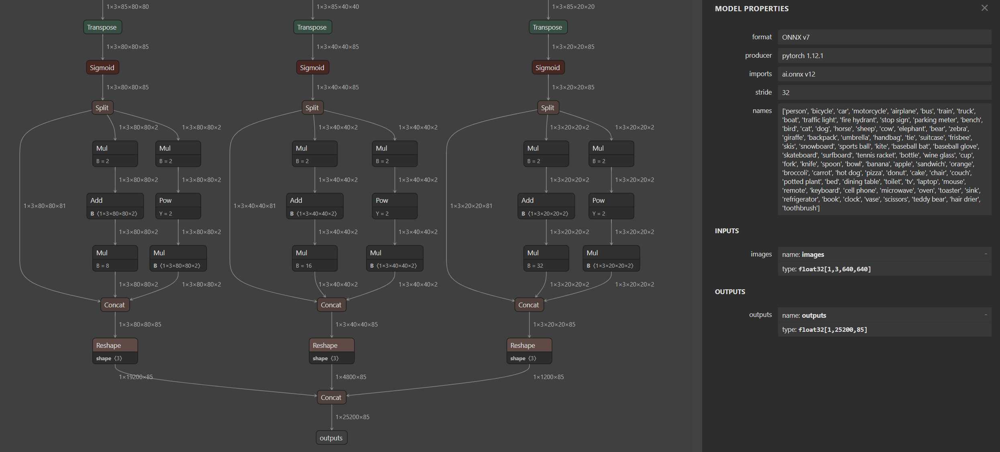
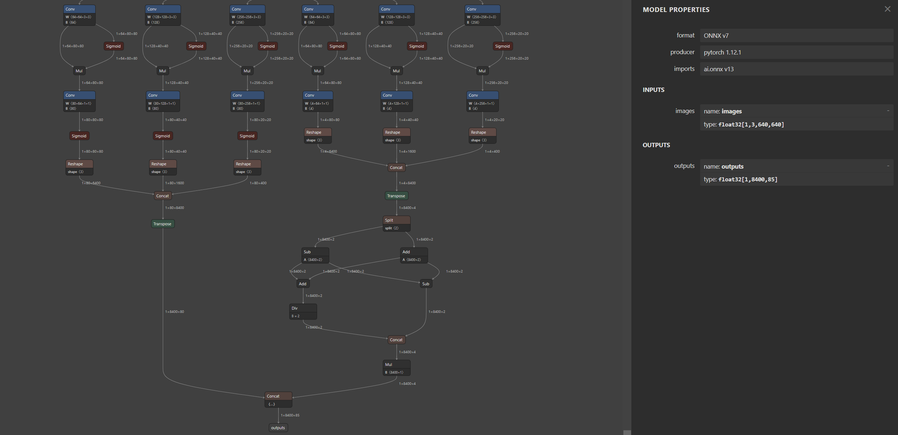
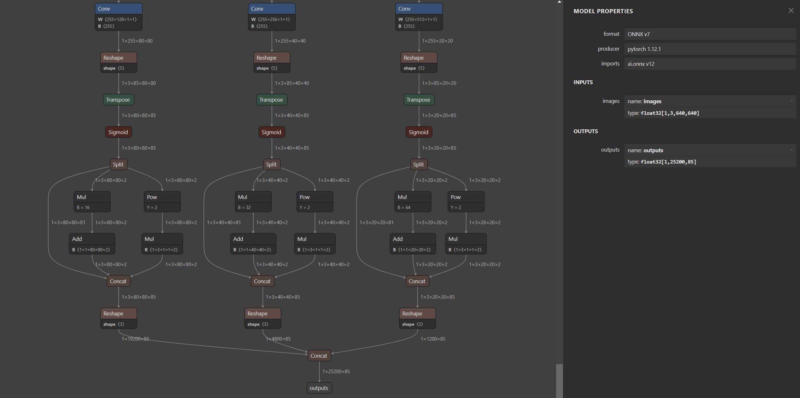
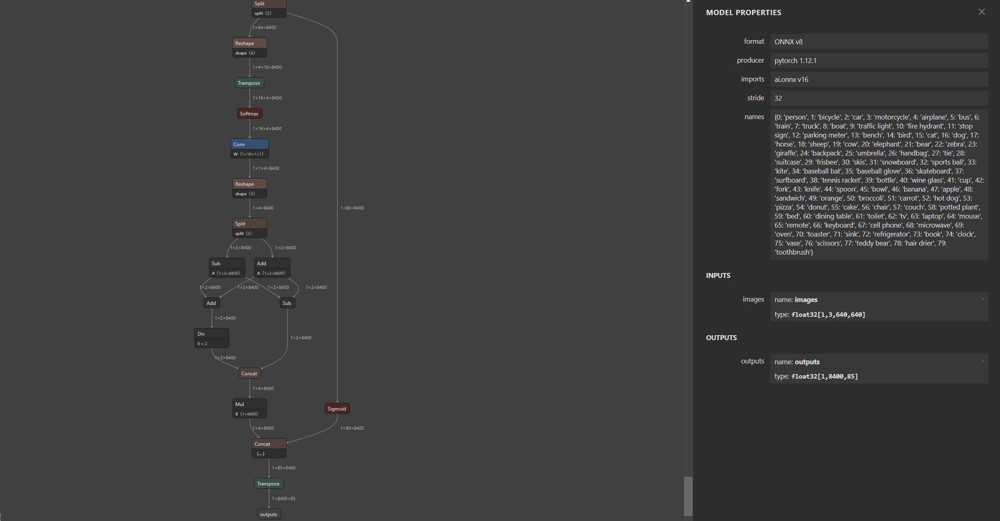
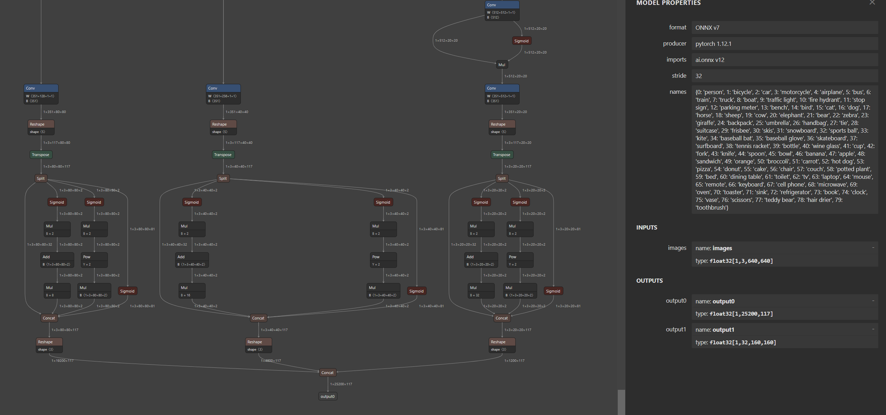
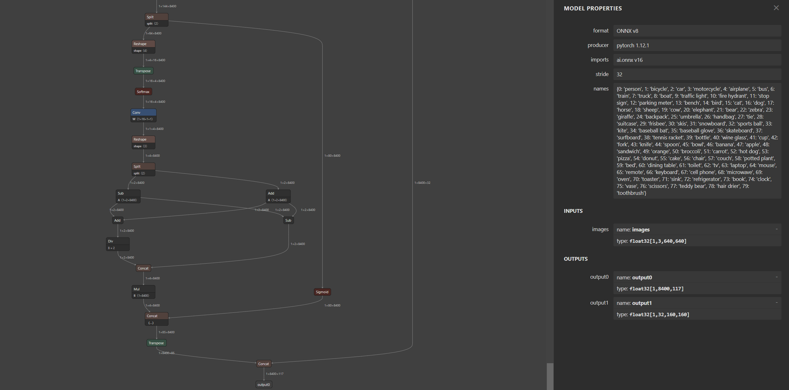
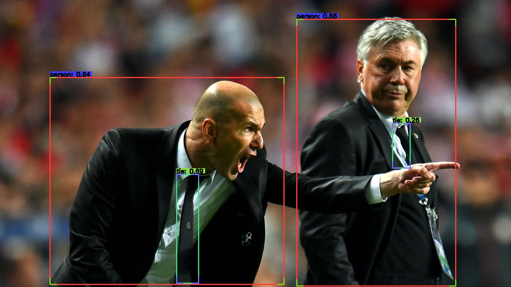
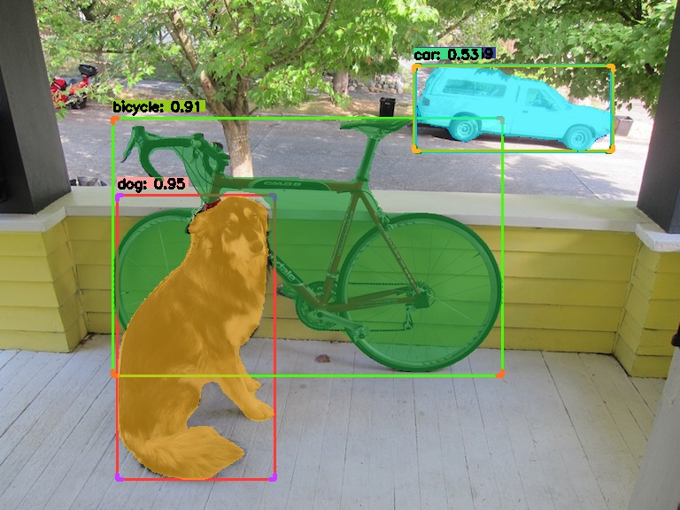

# YOLO_TRT_PY

 一套代码同时支持YOLOV5, V6, V7, V8 TRT推理 ™️  PYTHON :airplane:

 该REPO功能描述：
 - 支持image和video 推理；
 - 支持YOLOV5 V6 V7 V8 推理；
 - TRT模型加速PYTHON 版本，友好的封装格式，便于学习

### MY ENVIRONMENT

- cuda 11.7
- cudnn 8.4
- opencv 4.6
- tensorrt 8.4
- pycuda

## Det
### ONNX
pipeline: pt-->onnx-->engine

YOLOV5 onnx:

```
https://github.com/ultralytics/yolov5
python export.py --weights weights/yolov5s.pt --simplify
```


YOLOV6 onnx:
```
https://github.com/meituan/YOLOv6
python deploy/ONNX/export_onnx.py --weights weights/yolov6s.pt --simplify
```


YOLOV7 onnx:
```
https://github.com/WongKinYiu/yolov7
python export.py --weights weights/yolov7s.pt --grid --simplify 
```


YOLOV8 onnx:
```
pip install ultralytics

modules.py
410行改成：
# 1 84 8400 --> 1 85 8400
y = torch.cat((dbox, torch.ones(1, 1, 8400), cls.sigmoid()), 1)
# 1 85 8400 --> 1 8400 85
y = torch.transpose(y, 2, 1)

exporter.py
283行改成：
output_names = ['output0', 'output1'] if isinstance(self.model, SegmentationModel) else ['outputs']

export.py:
from ultralytics import YOLO
model = YOLO("weights/yolov8s.pt") 
success = model.export(mode='export',format="onnx", opset=16, simplify=True) 

python export.py
```



## Seg

YOLOV5 onnx:

```
https://github.com/ultralytics/yolov5
python export.py --weights weights/yolov5s-seg.pt --simplify
```


YOLOv8 onnx:
```
pip install ultralytics

```




### Engine
onnx 生成 engine 常用方案：
```
trtexec --onnx=xxx.onnx --saveEngine=xxx.engine --fp32
trtexec --onnx=xxx.onnx --saveEngine=xxx.engine --fp16
```


### RUN

#### Det

python Inference_trt_det.py



### Seg

python Inference_trt_seg.py




记得star :heartpulse: 